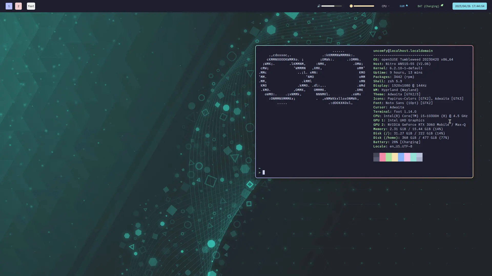

+++
title = "I switched to Hyprland"
description = "a new workflow that i may stay for a while"
date = 2023-04-25
authors = ["Soc Virnyl Estela"]
[taxonomies]
tags = [
  "wayland",
  "window-manager",
  "workflow"
]
+++

# Disclaimer

I really do not care what window manager or desktop environment you are using.
For me, it is stupid to start flame wars when it comes to things like these
including editors and browsers. Because what the hell are you doing with life
if you focus your energy on something so childish and unproductive? 

*Use whatever fits for you, don't let others dictate what you use. Life is short* 😄

# So yeah - window managers go brrr...

I am a fan of using window managers especially those that have tiling and
workspace functionality. I experienced using many tiling window managers such
as i3wm, swaywm, xmonad, and leftwm. And I *used to* daily drive [riverwm](https://github.com/riverwm/river),
a week before the time I am writing this.
For me, my motivations in using a window manager are the following criteria:

- **Sane configuration**. I really dislike a configuration that requires you to
learn a programming language. I am looking at you XMonad.
- **Community Support**. If there are many users, then it's probably a good
window manager.
- **WiKi**. What I Know Is.
- **Extensibility**
- **Multi-Monitor** support and mirroring.
- **Dynamic tiling** with tabs support.
- **Wayland**. Because it's the trend now on major distributions. 

Below are the window managers/compositors that I listed to be potential for
my daily drive usage.

## i3

It fits most of the the criteria ***except*** the part where it's
not Wayland and it does not have dynamic tiling by default (yes, you can use
a plugin for that but no... too much hassle). 

[Wayland](https://wayland.freedesktop.org) is now the trend for
*major distributions* such as openSUSE, Fedora, and Ubuntu. I really do not care
much about the politics but the Xorg Foundation seems to be focused now on the
development of Wayland as they claim that X11 and X server is technological 
burden that they don't want to maintain anymore as claimed by them.

> Wayland is a replacement for the X11 window system protocol and architecture 
with the aim to be easier to develop, extend, and maintain

So no for i3. 😥

## Sway

Wayland? Check. Dynamic tiling? No, but I don't want to install a plugin to add
dynamic tiling.

"But that's just one thing?". I do agree, however, Sway and other wlroots-based
Wayland compositors do not have proper multi-monitor support, especially the
part where *I can't mirror my output* to an external display. It's a wlroots issue
and I really can't blame the Wayland and Wlroots developers since they are
doing this in their free time even with tools such as wlr-randr and kanshi.

## River

This was my daily driver and been using it since early February 2022. It's a 
dynamic tiling compositor with extensible layouts through the river-protocols
specifically `river-layout-v3`, therefore, you can make your own layout generator in
any language. Notable layout generators that I have tried other than the default
`rivertile` are `rivercarro` and `stacktile`. But as river is also a wlroots-based
Wayland compositor, I have the same issues that I have with sway on output mirroring.

# Now why Hyprland?

As much as I love [river](#river), I have to use an external monitor (smart TVs and projector)
 every weekdays for lectures because I am an instructor for a private university 
in the field of chemistry, and biology and some humanities-related subjects. This led me
to use [LeftWM](https://github.com/leftwm/leftwm) as my dynamic tiler written in Rust.

But as it is not Wayland, I have to look for an alternative which has good external monitor
support with output mirroring. LeftWM is great, but I can't remain maintaining two
dotfiles...

So yes, I noticed [Hyprland](https://hyprland.org) from one of my friends who also uses Wayland.
It was still beta at that time and I have heard many bugs so I was not really into it
until someone packaged it in openSUSE Build Service and submitted it the openSUSE Wayland project
and openSUSE Factory project. That led me to try it and package `xdg-desktop-portal-hyprland`
in my own openSUSE Build Service project and install Hyprland.

## Features

Hyprland has the following features (maybe I miss some of them but whatever):

- IPC support
- Dynamic tiling by default
- Hyprland protocols
- Portals
- Global Shortcuts

Because Hyprland has IPC support, this means users can create their own way to communicate
and control the compositor. I rarely use this feature even in Sway because I just use usually
what it brings on the table by default. It's also dynamic tiling and supports two kinds of layouts:

- Dwindle
- Master (and stack)

I love the Dwindle layout since it's easy to rearrange the windows around to my fav master layout.

Hyprland also has an extension protocol for Wayland which is designed to be used with Hyprland itself.
This protocol was made so that it can be used with its fork of the Portal implementation for
wlroots based compositors, known as `xdg-desktop-portal-hyprland`. This fork addresses the following:

1. Screen selection - it now supports window selections now as well. This means, you can now specify
which client/window you want to show on the screen.
2. Global shortcuts - it now supports global shortcuts which is an extension of the Wayland protocol
which uses Portals.

I have not experienced global shortcuts in KDE Plasma on X11 before so I really do not know
what to say about it. But people are hyping on it so I guess that functionality is a good thing.

## My decision

I switched to Hyprland for the following things

- **Good monitor support**. I want to emphasize how I have trouble using `wlr-randr` and `kanshi` only
to see an open issue on wlroots regarding mirror output support.
- **Dynamic tiling** by default. 
- **Portals**. The fork is great ☺️. I can finally share a specific window if I wanted to now.

Additionally, the eye-candy. I have not customized for a long time now for river. Ricing was a tedious
task and usually a waste of time that's why. But with Hyprland, I think that fire has somewhat lit up
again. Although, my current configuration for Hyprland is simple, at least I know that I can easily
rice it up if I wanted to (round-corners look nice btw!). So yes, here is my setup with [eww](https://elkowar.github.io/eww/eww.html)
as my bar 😁

