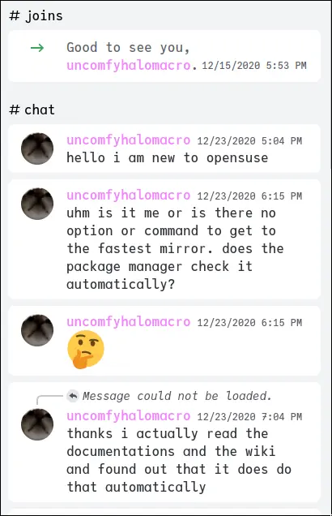
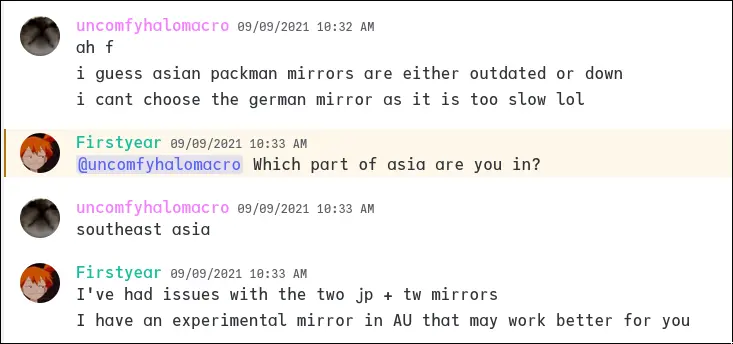
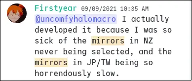
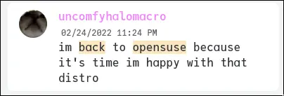

+++
title = "Journey to openSUSE"
description = "here i share my linux journey"
date = 2023-06-09
draft = false
+++

# About openSUSE

<i class="fa-brands fa-suse"></i> openSUSE is a community derivative of the
SUSE Linux Enterprise geared for developers, servers, and enthusiasts. Like any
Linux distribution, it provides loads of quality software for many users and
supports modern systems.

Try out openSUSE by following the link [https://get.opensuse.org](https://get.opensuse.org).

# When I hopped over to openSUSE

**IT WAS NOT GOOD**. Keyword "was". Hear me out. I tried out openSUSE around the year 2020.

I joined openSUSE Discord but left as soon as I realized the mirror situation. I complained
like ***a lot***. The distribution is actually very good. I just don't want to live in
a time where I suffer from slow updates. It's why I came back to [Manjarno](https://manjarno.snorlax.sh).

But before we get into the part where I [hopped back](#i-hopped-back-to-opensuse-twice) to openSUSE, let me talk about the 
brief history of my Linux journey.

# My Linux Journey

So my Linux journey started around the year 2019 when the COVID-19 pandemic happened. My old laptop became slow around that
time. To save money and to avoid the cost of buying a new laptop, we bought replacement parts and while waiting for them to
arrive, I decided to try Linux on the month of May of 2020. Windows 10 became so slow on my old machine and I was thinking,
"I know I am smart enough to read books and manuals, so why not Linux?". I got my flashdrive, downloaded 
[Debian](https://www.debian.org) Stable, burned the ISO to the flashdrive through [Rufus](https://rufus.ie) and then just basically
wiped Windows and replaced it with Debian. I was pretty sure the first DE I tried was KDE Plasma. 

The distributions I tried are actually enough for writing, presenting, and schooling!

## Arch Linux for the new year of 2021

I was very curious of [Arch Linux](https://archlinux.org) and the hype around the distribution. 
It turns out, the appealing aspect of Arch was the fact that you can modify and install what you 
want on this distribution. I daily drived it *with some hopping over to other \*nix distributions of course (such
as FreeBSD which is not a linux distribution)*.

## The rest of the stuff is distrohopping 🤦‍♂️

I mean if we want to breakdown all the distros I tried, not just Linux, here it is:

- 2020
  - Debian
  - Xubuntu
  - Manjaro
  - Artix
- 2021
  - Arch
  - Void
  - Fedora
  - FreeBSD

In 2022, I daily drived Void Linux from January to June-ish. Once my new laptop arrived, I then just full hopped on Fedora,
only to be disappointed, I forgot what it was though. Went to Arch for a little bit. Then I came back top openSUSE.

# I hopped back to openSUSE. Twice.

It was 2021. I hopped back to openSUSE and uh, the mirror situation was still not great. I will have to time it every late at night just
for an update to complete by the next day... *imagine that*... 

But I persevered. It's annoying enough to hop back and forth only because of the mirrors but I believed and hoped that
improvements of the mirror situation. And someone did improve it!!!

## Firstyear steps in

I tried many mirrors around and I was not very happy. Many times, I either get an outdated mirror or a dead mirror.

[Firstyear](https://github.com/firstyear) was one of the victims of the mirror situation. I think at that time, he was
exploring some ways on how to fix the mirror issue. Because he is not just a user, the mirror situation affected
his work. tl;dr he works at [SUSE LLC](https://www.suse.com) and mirrors were bad.

Here are some screenshots of our conversation in [openSUSE Discord](https://discord.gg/opensuse) regarding mirrors:

I was probably a few days late for an update but oh well...

Basically, he just did a Thanos move.

It took a while. Or more like a year before it has improved.

## Took a while

It did took another year after that because there were still some rough edges. 

So I came back to Void for quite a while until 2022 happened. I came back again for openSUSE for the reason that I feel 
like I do not really belong in the Void community. I felt at home to openSUSE so it's why I came back. And I came back with
improved infrastructure because Firstyear and co-contributors finally solved the mirror issue!

And I stayed using openSUSE until the time I was writing this. 😳

# Why openSUSE <i class="fa-brands fa-suse"></i>?

openSUSE is a very underrated distribution. I don't care much about the controversies for why that is, people like to gossip including myself :P

Anyway, I chose openSUSE because for many reasons but here are the major ones.

## Easier to contribute

Unlike other distros that I tried, openSUSE seems to be open on encouraging users to contribute in various parts of the distribution from 
the openSUSE Build Services, the openSUSE Wiki, and packaging. 

I learned mostly about packaging because it's that area that I am most interested in when I tried openSUSE. Firstyear taught me about
the RPM specification and RPM specfiles. As of writing, I managed to package at least 10 software, mostly related to Rust or Wayland such
as `mdbook`, `swww`, and `xdg-desktop-hyprland`.

## Amazing community

I met lots of talented and skilled individuals in openSUSE that I really just want to steal their brain and make theirs mine.

There are a lot of people as well that are humorous and funny to a point I really like to lurk there sometimes.

But again, that's because we have amazing moderators.

## I learned a lot

When I joined openSUSE, I learned lives of different people there and met some fellow people who use different kind of
OSes. I learned about their perspectives in the tech community. And I think being in openSUSE really opened my eyes
that there is much more than "free" and "open-source software". Various people have different reasons of using Linux.

## Would I still use openSUSE forever?

Depends. Maybe in the future my needs may become entirely different. I have been eyeing on reproducibility
where I can predict my current setup is the same across different machines such as NixOS and other immutable
distributions such as openSUSE Aeon and Fedora Silverblue.

But I won't forget about the openSUSE community ☺️
