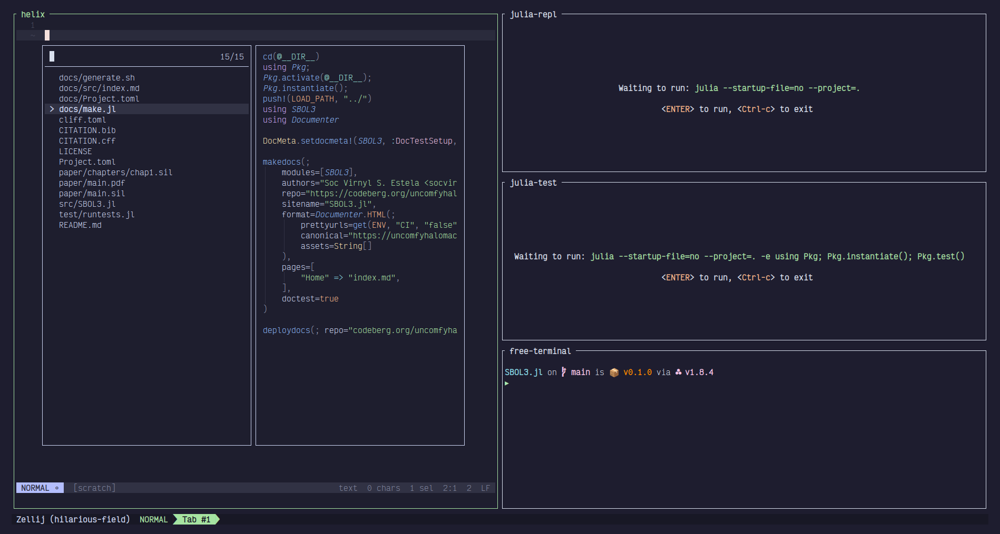

+++
title = "Julia x Zellij"
description = "a short post about how this workflow works"
date = 2022-12-19
+++

## Multiplexing workflows

A _multiplexer_ is a program that multiplex a screen into several splits usually separated
with their own purpose and function. In this post, the multiplexers we are talking about is
for the terminal.

There are many multiplexing programs that exist today such as screen, tmux, and [zellij][zellij].
They serve similar purposes in that each split, pane, tab or whatever they call it can specific 
programs to your liking e.g. running htop, editing a file, listing passwords. Other multiplexing
capabilities maybe is already built-in with your terminal emulator e.g. [kitty][kitty] and [wezterm][wezterm]
are known to have such features.

So how does a multiplexing workflow help you improve your [Julia][julia] package development?

## What is [Zellij][zellij]?

**Zellij** is one of the popular rust cli tools that exist today - a multiplexer with batteries included and
soon to have plugins support. I am writing this blog with the help of zellij using a layout
that runs zola. It's a simple layout you can use as you can see below.

```kdl
layout {
  pane split_direction="vertical" {
    pane command="helix"
    pane split_direction="horizontal" {
      zola { args "check"; }
      zola { args "build"; }
      zola { args "serve"; }
      pane {
      	name "free-terminal"
      }
    }
  }
  pane size=1 borderless=true {
    plugin location="zellij:compact-bar"
  }
  pane_template name="zola" {
    command "zola"
    start_suspended true
  }
}
```

## Julia x Zellij

As you can see from the example layout from the previous section, you can finally get an idea
of how to integrate `julia` with `zellij`. 

```kdl
layout {
  pane split_direction="vertical" {
  	pane command="helix"
  	pane split_direction="horizontal" {
  		pane {
  			name "julia-repl"
  			command "julia"
  			args "--startup-file=no" "--project=." 
  			start_suspended true
  		}
  		pane {
  			name "julia-test"
  			command "julia"
  			args "--startup-file=no" "--project=." "-e" "using Pkg; Pkg.instantiate(); Pkg.test()"
  			start_suspended true
  		}
  		pane {
  			name "free-terminal"
  			focus true
  		}
  	}
  }
  pane size=1 borderless=true {
  	plugin location="zellij:compact-bar"
  }
}
```

This results with the layout below: 



- Left contains your editor
- Right contains the following:
  - Julia REPL
  - Julia Pkg.test() command
  - Terminal

This layout makes it easy for you to test and rerun commands for your Julia package development.

## Now what?

This may not be your workflow but for those who are interested in using [zellij][zellij] may find it a good
idea to integrate this workflow for their next Julia project. Thanks for reading this short post.

[kitty]: https://sw.kovidgoyal.net/kitty/
[wezterm]: https://wezfurlong.org/wezterm/
[zellij]: https://zellij.dev
[julia]: https://julialang.org