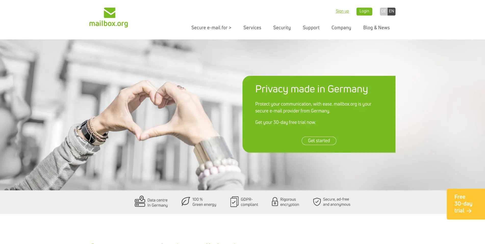
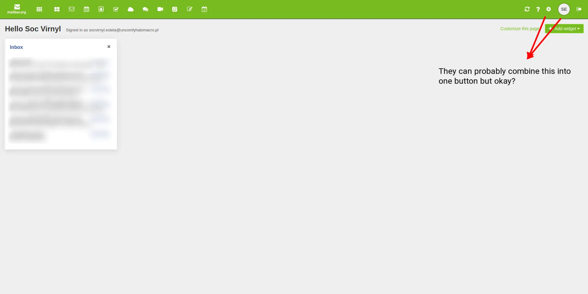
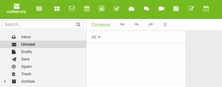
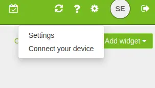

+++
title = "First impressions on my first non-Google email provider"
description = "my first step in de-Googling"
date = 2023-09-19
authors = ["Soc Virnyl Estela"]
[taxonomies]
tags = ["workflow", "lifestyle"]
+++

I was planning last year that I will have to start looking for ways to avoid
Google as much as possible or at least minimize my dependence on Google
services. *It's most likely the latter*.

# On September 18, 2023

I finally switched to a new email provider called
[Mailbox](https://mailbox.org). I have little information about the company
but it seems it's well known from various tech people I met.

# First impressions

When I went to their website, it looks so clean and green like the "green
energy" message they have on their landing page.

But sadly, when I bought for their services, I was not really impressed by
their web client. It was... uncared for? I am not sure why the landing page
looks so cool but the placement for their settings is so weird. Here are a
list of screenshots so you would understand what I mean.

Another nitpick is the inconsistency of the tooltip. It should show the tooltip
*when the selection happens* and NOT *after you are centered on the button*.

Also, when clicking settings, I have to click... *twice*? One for the
gear icon, which will create two options as a drop-down; one for settings,
and one for "connect your device". That's the weirdest way to navigate to
settings. It's subtle but it's such a **huge** inconsistency. Kind of
a missed opportunity.

## Then what?

For other stuff, it was alright. But it feels so dated. It's good since it's
light I am fine with that. I just don't know why the placement/behavior of
the buttons/settings are all over the place. Maybe I am wrong? If anyone
reading this is a front-end designer or specializes in UI/UX, please tell me
if I am wrong.

# Services

Well enough of the UI, how about their services?

So I bought the 9EUR per month *monthly plan* which amounts to
545.74PHP—***Premium Plan***:

- Mail Storage of 25GB 
- Cloud Storage of 50GB 
- 25 Mail aliases 
- Allows 250 aliases for custom domains 
- Gets more support
  - Online office 
  - Priority & phone

Sounds great? To be honest, I bought this plan because I want to try the
most expensive offering.

But it's too early to tell so I will try this for a year and get the yearly
plan. So I will get a month using the monthly plan and once for the yearly
plan; a total of 13 months. Unlucky!

I will be going to skip a bit of the features since I haven't got used to it
yet. But one thing that interests me to use more and more is the DavFS/WebDav
feature. Although, there documentation was not really accurate nor informative
about it. Yes, they have a documentation but what I mean is, it feels rushed.

Other features are mentioned in
https://mailbox.org/en/private-customers#price-plans.

# Overall

Again, it's too early to say anything. But one thing I already did is
"forwarding" all my emails from my previous Gmail account to my new mailbox
email addresses and aliases. And I already copied almost all of my old inboxes
to my new inboxes.

# Other considerations

I was eyeing for [Fastmail](https://www.fastmail.com/) since

1. It's recommended by my mentor (bias)
2. It's in Aussieland, so it's closer. And also the only email service near 
southeast asia because Asia seems to have no email service company. *Kind of 
makes sense, but I will keep it to myself* 😛
3. Has more enticing offerings and features. At the same price, you get 100GB and 600+ aliases.
4. Probably has a better UI for their web client. Their website says it all.

For now, I will be using this for a year.
