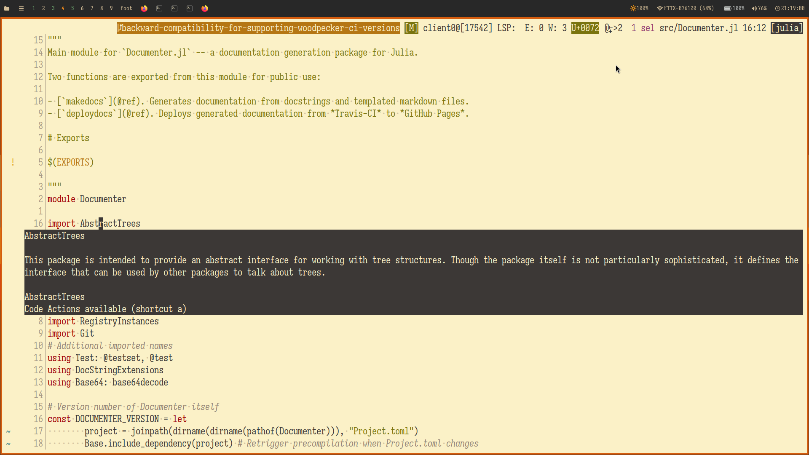
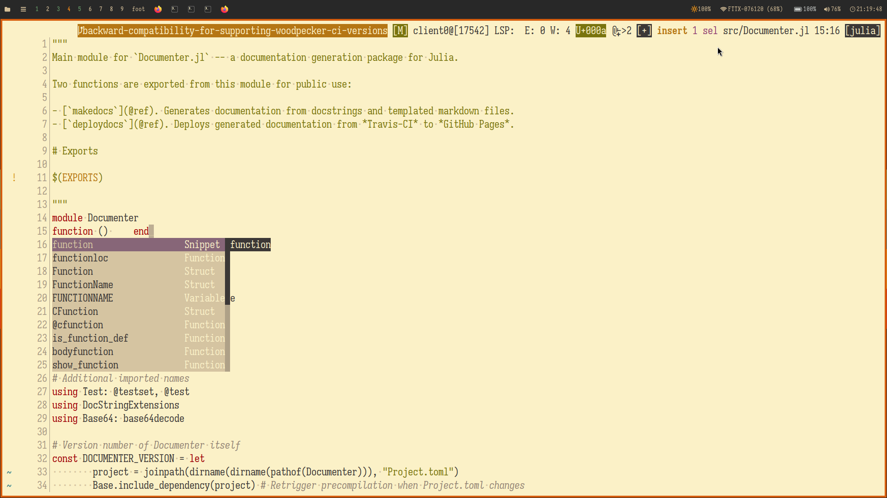

+++
title = "How To Setup Julia with Kakoune"
date = 2024-06-08
[taxonomies]
tags = ["editor", "kakoune", "julia"]
+++

This short post talks about how I setup Julia for Kakoune based of from my
[config](https://github.com/uncomfyhalomacro/kakudite). I rarely use
Julia nowadays but some people still ask me how to setup Julia for X and Y
editor lmao. So I'm just going to write it here to help others out a bit.

# What is Kakoune?

[Kakoune](https://github.com/mawww/kakoune) is a modal editor that tries to
be better than Vim. It reverses the action-verb syntax of Vim e.g. `dw` for
delete word in Vim, `wd` in Kakoune.  And it also removes some inconsistencies
of the Vim editor when it comes to other functions of which I won't discuss
and which you have to find out yourself.

The editor also has multi-cursors which is a controversial topic among
terminal editor enthusiasts. But it's a good fit for Kakoune because of its
"haptic" feedback or more accurately visual feedback that shows a selection
before we can do any action.

The editor also has some kind of session/server support where you can edit in
the same server socket. This allows multi-window editing without the actual
need of a multiplexer (although, most users do actually use a multiplexer to
make the experience better). Here is an example script to allow me to connect
an existing session with `sk` or [skim](https://github.com/lotabout/skim)
(an fzf clone in Rust).

```bash
#!/bin/bash

set -euo pipefail

shopt -s lastpipe

SESSION=$(kak -l \
	| sk \
	--prompt "choose an existing kakoune session> "\
	--header "sessions" --reverse)

export SESSION
[ -z "${SESSION}" ] && exit 1
kak -c $SESSION $@ && exit 0
```

The editor also has its own configuration language called kakscript. Although
it's better for you to explore what it is since it will be discussed in
this post.

This editor is highly opinionated and many mixed opinions among Vimmers.
I don't consider myself a Vim expert nor a Kakoune expert but I have experienced
using many editors since the start of COVID-19.

# Setup

Some prerequisites needed:
- Installed `cargo` from Rust
- Kakoune itself
- Julia

Assuming you already have the prerequisites, head to `$XDG_CONFIG_HOME/kak` or
`~/.config/kak`.  If the directory does not exist, create it with `md` or
`mkdir`. Next, at the root of the `$XDG_CONFIG_HOME/kak`
or `~/.config/kak` let's add a bootstrap install script for
[kak-bundle](https://github.com/jdugan6240/kak-bundle) in the file `kakrc`.

```sh
evaluate-commands %sh{
  # We're assuming the default bundle_path here...
  plugins="$kak_config/bundle"
  mkdir -p "$plugins"
  [ ! -e "$plugins/kak-bundle" ] && \
    git clone -q https://github.com/jdugan6240/kak-bundle "$plugins/kak-bundle"
  printf "%s\n" "source '$plugins/kak-bundle/rc/kak-bundle.kak'"
}

bundle-noload kak-bundle https://github.com/jdugan6240/kak-bundle
```

The script was written in a configuration language called kakoune script
or kakscript. The idea behind the language is to utilise the built-in shell
that is assumed to be POSIX-compliant or POSIX-compatible e.g.  bash, zsh,
sh, dash, et cetera.

## Installing Kakoune LSP

Some people including me can't live without LSP so let's include that to
our `kakrc` file.

```sh
bundle kakoune-lsp 'git clone --depth 1 -b v17.0.1 https://github.com/kakoune-lsp/kakoune-lsp'  %{

    hook global WinSetOption filetype=(julia) %{
        set global lsp_hover_anchor false
        set global lsp_auto_show_code_actions true
        lsp-enable-window
        map global user l %{: enter-user-mode lsp<ret>} -docstring "lsp mode commands"
        map global goto w '<esc>: lsp-hover-buffer lsp-info-window <ret>' -docstring 'lsp-info-window'
        # define-command -docstring 'lsp-logs: shows lsp logs on tmux window' lsp-logs -params 0 %{
            # terminal sh -c 'less +F /tmp/kak-lsp.log'
        # }
        # map global goto L '<esc>: lsp-logs <ret>' -docstring 'show lsp logs on another window'
    }

    hook global KakEnd .* %{
        lsp-exit
        nop %sh{
            rm -v /tmp/kak-lsp.log
        }
    }

} %{}
```

We also need to add a bootstrap script to install the LanguageServer.jl package with
PackageCompiler.jl. At the root of the `$XDG_CONFIG_HOME/kak` or `~/.config/kak`, create
the directory `scripts`. Then create the file `scripts/julia-ls-install` with the following
contents

```julia
import Pkg; Pkg.add("PackageCompiler"); 
Pkg.add(url="https://github.com/julia-vscode/LanguageServer.jl", rev="master"); 
Pkg.update();
using PackageCompiler; create_sysimage(:LanguageServer, sysimage_path=dirname(Pkg.Types.Context().env.project_file) * "/languageserver.so")
```

And in the `$XDG_CONFIG_HOME/kak/kakrc` or `~/.config/kak/kakrc` file, append the following contents

```sh
bundle-install-hook kakoune-lsp %{
    cargo install --path . --root "${HOME}/.local"
    julia --project=@kak-lsp "${kak_config}"/scripts/julia-ls-install
}
```

This will allow you to install kakoune-lsp as well as Julia's LanguageServer.jl and PackageCompiler.jl.

The script allows you to run a precompiled sysimage of the Julia LanguageServer.jl (although it's not needed
that much ever since precompilation has improved since version 1.9 of Julia).

## Configuring the LSP

kakoune-lsp also needs to have a file that configures the LSP of any language. At the root
of the `$XDG_CONFIG_HOME/kak-lsp` or `~/.config/kak-lsp`, create the file `kak-lsp.toml`. If the
directory does not exist, create it first before creating the file. Add the following
contents to the file

```toml
snippet_support = true
verbosity = 2

[server]
timeout = 1800 # seconds = 30 minutes

[language_server.julia]
filetypes = ["julia"]
roots = ["Project.toml", ".git", ".hg", "Manifest.toml"]
command = "sh"
args = ["-c",
   """
   julia --startup-file=no --history-file=no --project=@kak-lsp ~/.config/kak/scripts/julia-ls-kak
   """,
]

[language_server.julia.settings]
julia.format.indent = 4
julia.lint.call = true
julia.lint.run = true
julia.missingrefs = "all"
julia.lint.iter = true
julia.modname = true

[semantic_tokens]
faces = [
    {face="documentation", token="comment", modifiers=["documentation"]},
    {face="comment", token="comment"},
    {face="function", token="function"},
    {face="keyword", token="keyword"},
    {face="module", token="namespace"},
    {face="operator", token="operator"},
    {face="string", token="string"},
    {face="type", token="type"},
    {face="default+d", token="variable", modifiers=["readonly"]},
    {face="default+d", token="variable", modifiers=["constant"]},
    {face="variable", token="variable"},
]
```

Then at the root of the `$XDG_CONFIG_HOME/kak` or `~/.config/kak`, add a new file `scripts/julia-ls-kak`
with the following content

```julia
import Pkg

"""
  `buffer_file_path`

Gets `buffer-file-name` value which gives
the full path to the file associated with the buffer.
"""
buffer_file_path = if haskey(ENV, "kak_buffile")
    ENV["kak_buffile"]
elseif haskey(ENV, "KAK_LSP_PROJECT_ROOT_JULIA")
    ENV["kak_buffile"] = ENV["KAK_LSP_PROJECT_ROOT_JULIA"]
else
    ENV["kak_buffile"] = Pkg.Types.Context().env.project_file
end

"""
  `project_path`

Gets the full path of the project where the LSP should
start. The steps starts with the following:

1. Check if there is an explicitly set project.
2. Check for Project.toml from buffer's full file path exluding the file name.
3. Check for Project.toml in current working directory.
4. Fallback to global environment.
"""
project_path = let
    dirname(something(

        Base.load_path_expand((
            p = get(ENV, "JULIA_PROJECT", nothing);
            p === nothing ? nothing : isempty(p) ? nothing : p
        )),
        Base.current_project(strip(buffer_file_path)),
        Base.current_project(pwd()),
        Pkg.Types.Context().env.project_file,
        Base.active_project()
    ))
end

# Activate the project
Pkg.activate(project_path)
# Install packages if they weren't installed
Pkg.instantiate(; verbose=true)
# Then remove it from the LOAD_PATH
# We did this just to get the packages for the
# project, we do not need it for the LSP.
popfirst!(LOAD_PATH)

ls_install_path = joinpath(get(DEPOT_PATH, 1, joinpath(homedir(), ".julia")), "environments", "kak-lsp");
pushfirst!(LOAD_PATH, ls_install_path);
using LanguageServer;
popfirst!(LOAD_PATH);
depot_path = get(ENV, "JULIA_DEPOT_PATH", "")
symbol_server_path = joinpath(homedir(), ".cache", "julia_lsp_symbol_server")
mkpath(symbol_server_path)
server = LanguageServer.LanguageServerInstance(stdin, stdout, project_path, depot_path, nothing, symbol_server_path, true)
server.runlinter = true
run(server)
```

This is a custom LSP script I made to avoid the limitations of just running
`run(server)`. See the comments above the `project_path` variable.

# Conclusion

That's it. You have finally reached the end of the post and have configured
your kakoune editor to work with Julia.

Here are what the result should look like if (ignoring the statusline and
the gruvbox theme) if you have the config:

Hover:


Snippets and Completions:

