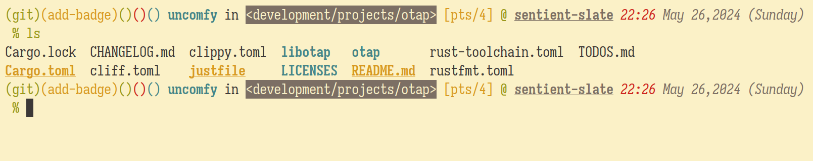

+++
title = "I probably need less information"
date = 2024-05-26
[taxonomies]
tags = ["workflow", "life"]
+++

"I probably need less information for your prompts." I told myself and
here is why I am convinced.

# Experience

Throughout my adventurous search for the best terminal prompts out there,
I am utterly convinced that I don't need fancy terminal prompts. Despite
what they have to offer like speed and performance, you only need a handful
of information and information you have to re-verify again and again in
the terminal.

You might be wondering, "but you need that information". Well, that depends
on the scenario.

Let's say, you are in a Julia project, you get the version number of Julia and
this glyph "" that may not render properly if your font does not support it.
How many times do you have to see it? How many times do you need to see it?

In my experience, I rarely do it. I just usually run `ls` and call it a day.

# I always check the files

And I rarely look at the fancy version and language indicator. When I work
on projects, what's most important to me are
- where i am aka
  - folder
  - directory
  - "everything is files on linux[^lmao]"
- git information
- time and date

I was not convinced at first because probably it's a lot of
work to change what I used to do. But thanks to this [post by
blainsmith](https://fosstodon.org/@blainsmith/112054633913133165) in the
fediverse, I changed my mind.

Now my prompt uses this configuration.

```zsh
autoload -Uz vcs_info
zstyle ':vcs_info:*' enable git
zstyle ':vcs_info:*' check-for-changes true
zstyle ':vcs_info:*' unstagedstr '!'
zstyle ':vcs_info:*' stagedstr '+'
zstyle ':vcs_info:git:*' formats "%F{green}(%s)%F{yellow}(%b)%F{green}(%c)%F{red}(%u)%F{blue}(%m)"
zstyle ':vcs_info:git:*' actionformats "%F{green}(%s)%F{yellow}(%b)%F{green}(%c)%F{red}(%u)%F{blue}(%m)%F{002}(%a)"
precmd_vcs_info() { vcs_info }
precmd_functions+=( precmd_vcs_info )
setopt prompt_subst
export PROMPT=$'\$vcs_info_msg_0_%F{010} %B%F{blue}%n%b%f in %F{black}%K{7}<%3~>%k%f %F{yellow}[%y] %F{green}@ %B%U%F{white}%M%u%b %{\x1b[3m%F{red}%T%} %F{white}%D{%b %d,%Y (%A)}
%{\x1b[0m%}%(?.%F{green} .%F{red}%? )%%%F{none} '
```

But keep in mind, I just skimmed through the [Zsh
Documentation](https://zsh.sourceforge.io/Doc/Release/Prompt-Expansion.html)
and just look at whatever all over the internet just to change some colors and
such. But it works so I guess that's also cool?

# New prompt look

Btw my old prompt uses default starship prompt so I guess everyone knows what
the default looks like so no need to give a screenshot. Now, my prompt
looks like this



[^lmao]: <https://en.wikipedia.org/wiki/Everything_is_a_file>
