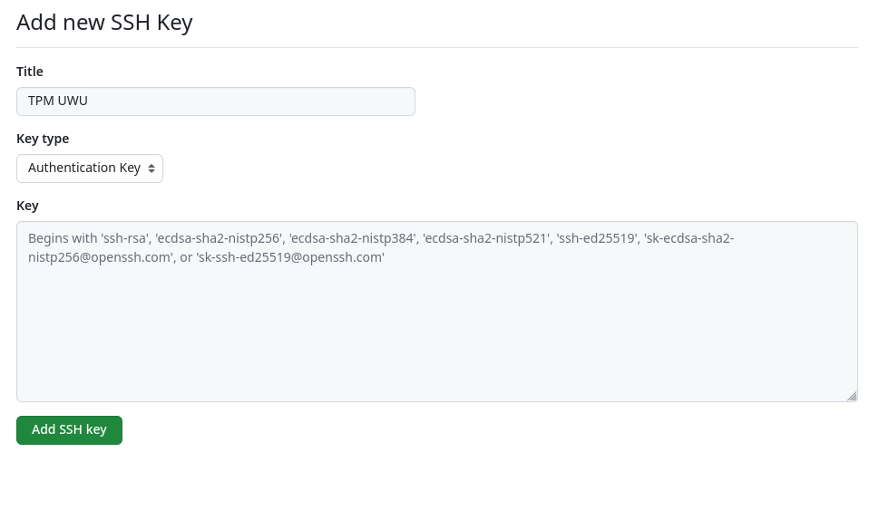
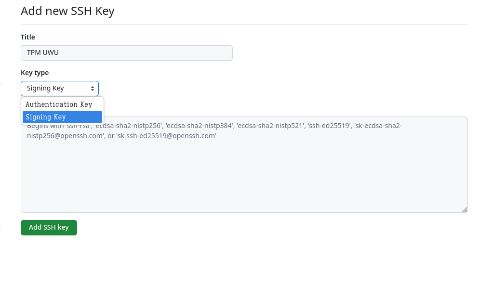

+++
title = "Using SSH keys with TPM and Git"
date = 2024-05-05
authors = ["Soc Virnyl Estela"]
[taxonomies]
tags = ["ssh", "git", "security"]
+++

So my mentor has already made a
[post](https://fy.blackhats.net.au/blog/2023-04-20-using-a-tpm-for-ssh-keys-on-opensuse-tumbleweed/)
about how to use TPMs in openSUSE.

I followed a bit, did some weird stuff because it doesn't work at first. It turns out I made a typo and missed a flag
🥴
<!-- more -->

Now that was all fixed, I was curious if I could use the key to verify my identity on GitHub or any forge e.g. Codeberg.
So I tried it on GitHub. Here was the process.

## Adding the SSH public key to GitHub

First, you have to add the pubkey to your ssh directory

```bash
ssh-keygen -D /usr/lib64/pkcs11/libtpm2_pkcs11.so.0 | tee ~/.ssh/id_ecdsa_tpm.pub
```

And then just copy the SSH pubkey. Here, I use `wl-copy` to copy it to my system clipboard. Make sure you clear your
system clipboard after. Add it in <https://github.com/settings/ssh/new>. For now, **set it as an Authentication Key**.

```bash
ssh-keygen -D /usr/lib64/pkcs11/libtpm2_pkcs11.so.0 | wl-copy
```



Next, we might want to add this as our way to sign git commits with SSH.

```bash
git config --global user.signingKey ~/.ssh/id_ecdsa_tpm.pub
```

It is up to you to sign your git commits. I do this globally.

```bash
git config --global commit.gpgsign true
git config --global gpg.format ssh
git config --global format.signOff true
```

Then like before, just add the SSH pubkey again as your signing key. Just select key type as **Signing Key**.



Lastly, edit your `~/.ssh/config` if you have one (or do something similar) like the one below

```
Host github.com
   User git
   PKCS11Provider /usr/lib64/pkcs11/libtpm2_pkcs11.so.0
   PasswordAuthentication no
```

## Some Caveats

The issue with this configuration is that ssh-agent can't add the private key automatically or permanently as of now. So you
have to do the command manually after a reboot or when ssh-agent expires (if you set it like that)

```bash
ssh-add -s /usr/lib64/pkcs11/libtpm2_pkcs11.so.0
```

ℹ️ You might want to configure that within your shell profile.

Once the private key is added, you can do basic SSH stuff with Git. 😄
